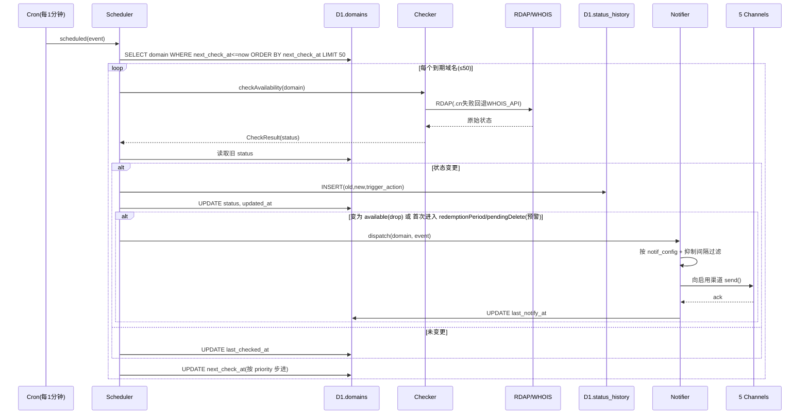
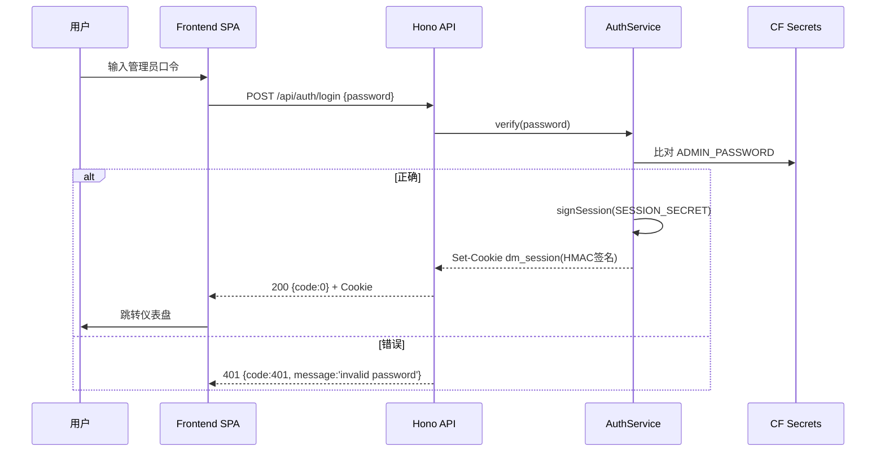
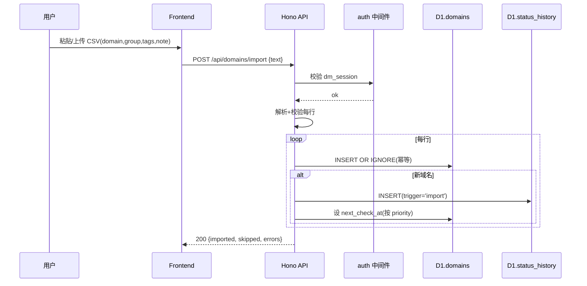
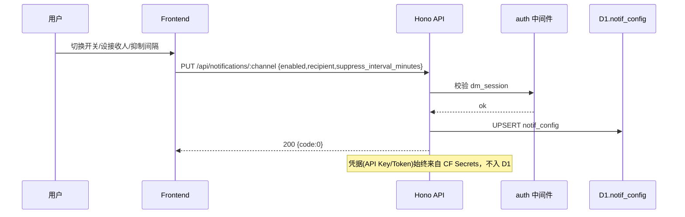
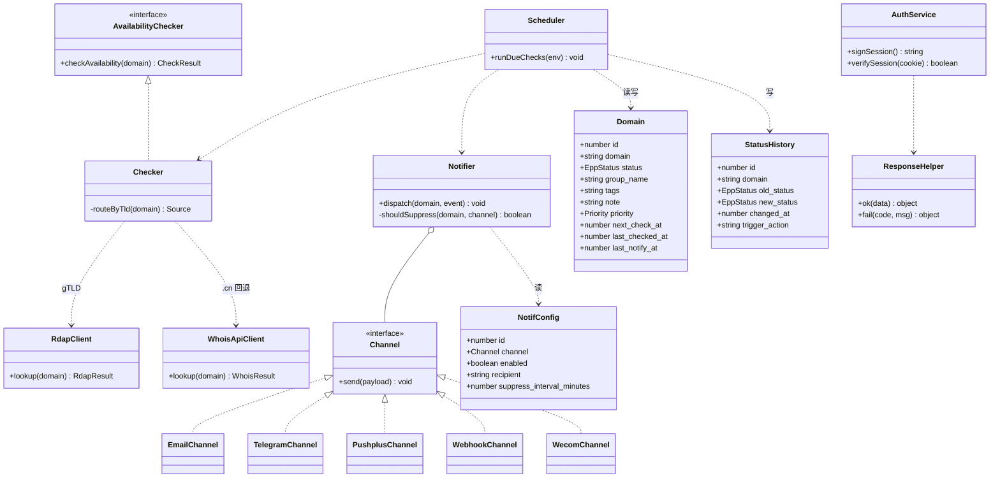

# 域名掉落监测与可注册性通知系统 — 系统架构设计（Architecture）

> **文档版本**：v1.0 ｜ **作者**：高见远（架构师）｜ **日期**：2026-10-03
> **依据**：`prd-domain-monitor.md` + 交付总监中转的「客户已确认范围决策」
> **定位**：本文件仅含架构设计与任务分解，**不含实现代码**，编码交给工程师（寇豆码）。

---

## 0. 设计决策回顾（客户已确认范围，已固化为硬约束）

| # | 决策点 | 结论 | 对设计的影响 |
|---|---|---|---|
| 1 | 域名范围 | **gTLD + .cn 全部监测** | 检测层必须「按 TLD 路由数据源」，预留 .cn 回退付费 WHOIS API |
| 2 | 售卖模式 | **单租户自用/小团队**，无多租户隔离 | 不做多用户、不做 workspace 隔离 |
| 3 | 鉴权 | **单管理员口令登录** + 签名 Session Cookie | 无账号表；`ADMIN_PASSWORD`/`SESSION_SECRET` 走 Secret |
| 4 | 通知渠道 | **Telegram + 邮件 + PushPlus + Webhook/企微 四个全做** | 通知层 5 个 Channel 实现（webhook 与企微共用 Channel 抽象） |

**平台硬约束（来自产品 + 客户）**
- Cron Triggers ≤ 3 个 / Worker，最小 1 分钟，免费 → 采用 **「单调度 Worker + D1 `next_check_at` 自适应」** 模式，仅用 **1 个 Cron（每 1 分钟）** 拉取 `next_check_at ≤ now` 的域名批量检测，单次最多 **50 个** RDAP 子请求（免费计划限制）。
- 密钥 **全部走 Cloudflare Secrets / 环境变量，绝不入代码库、不入 D1 明文**。
- 单租户单管理员：签名 Cookie（HMAC-SHA256，密钥源自 `SESSION_SECRET`），**无 D1 会话表**。
- .cn 检测：先试 RDAP（如 `rdap.cn`/CNNIC 公开接口），不可用回退到可配置付费 WHOIS API（`WHOIS_API_BASE` / `WHOIS_API_KEY`）。

---

## 1. 实现方案概述 + 框架选型

### 1.1 总体架构

```
┌──────────────────────────────────────────────────────────────────┐
│  GitHub (仓库) ──push main──┐                                       │
│                             ├─ Cloudflare Pages Git 集成 ─► Frontend SPA│
│                             └─ GitHub Action(wrangler) ─► Worker  │
└──────────────────────────────────────────────────────────────────┘
       浏览器 ──HTTPS──► Pages SPA(React) ──同站/API──► Worker(Hono)
                                                  │
                                          ┌───────┴────────┐
                                          ▼                ▼
                                       D1(sqlite)      Cron(1/min)
                                                        │
                                              ┌─────────┴──────────┐
                                              ▼                    ▼
                                         RDAP/WHOIS         通知分发(4渠道)
```

### 1.2 组件职责

| 组件 | 技术 | 职责 |
|---|---|---|
| **API Worker** | Cloudflare Workers (TS) + Hono | 同一 Worker 同时导出 `fetch`（REST API + 鉴权 + 域名/通知/历史/统计）与 `scheduled`（Cron 检测循环）。单一部署单元，满足 Cron ≤3/Worker。 |
| **D1** | Cloudflare D1 (SQLite) | 三张表：`domains` / `status_history` / `notif_config`。绑定名 `DB`。 |
| **Cron Trigger** | Cloudflare Cron Triggers | 1 个触发器（每 1 分钟）调 `scheduled`，由 `Scheduler` 拉取到期域名并批量检测 + 通知。 |
| **检测数据源** | 原生 `fetch` | `Checker` 按 TLD 路由：gTLD→注册局 RDAP（IANA bootstrap 解析端点）；.cn→RDAP 失败后回退 `WHOIS_API_BASE`。 |
| **通知层** | 原生 `fetch` + `@resend/sdk` | `Notifier` 统一分发到 5 个 Channel（email / telegram / pushplus / webhook / wecom），读取 `notif_config` 开关与 Secrets 凭据。 |
| **前端 SPA** | Vite + React + Tailwind | 仪表盘、域名列表/导入、通知配置、监测历史四页，托管于 Cloudflare Pages。 |
| **部署流水线** | GitHub + Pages Git 集成 + Wrangler GitHub Action | push main → Pages 自动构建部署；Action `wrangler deploy` 部署 Worker + 迁移 D1。 |
| **密钥管理** | Cloudflare Secrets / 环境变量 | `ADMIN_PASSWORD`、`SESSION_SECRET`、各通知渠道凭据，不入库。 |

---

## 2. 仓库文件结构（相对路径 + 单行职责）

```
doname/
├── README.md                         # 部署与运维文档（Secrets 清单、wrangler 命令、本地开发）
├── wrangler.toml                     # Worker 配置：main 入口、D1 绑定(DB)、Cron(1/min)、Secrets 声明
├── package.json                      # 根脚本（install:all、dev、deploy 组合命令）
├── .dev.vars                         # 本地开发 Secrets（不提交真实值，仅示例；gitignore）
├── .github/
│   └── workflows/
│       ├── deploy-worker.yml         # push main → wrangler deploy + d1 migrate（后端 CI）
│       └── deploy-pages.yml          # push main → 构建 frontend 并部署到 Pages（前端 CI）
├── worker/
│   ├── package.json                  # 后端依赖（hono、wrangler、@cloudflare/workers-types、@resend/sdk）
│   ├── tsconfig.json                 # 后端 TS 配置（workers 类型、strict）
│   ├── src/
│   │   ├── index.ts                  # Worker 入口：export default { fetch, scheduled }
│   │   ├── app.ts                    # Hono 应用装配：路由挂载 + 中间件 + 统一响应
│   │   ├── env.ts                    # Env 类型（Bindings: DB、Secrets、Vars）
│   │   ├── types.ts                  # 共享类型：EppStatus、Priority、Channel、CheckResult、ApiResp
│   │   ├── middleware/
│   │   │   └── auth.ts               # 鉴权中间件：校验 dm_session 签名 Cookie
│   │   ├── routes/
│   │   │   ├── auth.ts               # 登录/登出/会话校验
│   │   │   ├── domains.ts            # 域名 CRUD + 批量导入 + 列表筛选
│   │   │   ├── history.ts            # 监测历史筛选/分页/导出 CSV
│   │   │   ├── notifications.ts      # 通知配置读写 + 测试发送
│   │   │   └── stats.ts              # 仪表盘统计聚合
│   │   └── lib/
│   │       ├── response.ts           # 统一 JSON 响应封装 {code,data,message}
│   │       ├── db.ts                 # D1 访问封装（预处理语句、事务、查询函数）
│   │       ├── auth.ts               # HMAC 签名/校验 Session Cookie（Web Crypto）
│   │       ├── status.ts             # EPP 状态枚举 + 状态转移判定（drop/预警）
│   │       ├── checker.ts            # checkAvailability 抽象 + TLD 路由（核心扩展点）
│   │       ├── rdap.ts               # RDAP 客户端（IANA bootstrap + 注册局查询）
│   │       ├── whoisApi.ts           # 付费 WHOIS/可用性 API 回退客户端
│   │       ├── scheduler.ts          # Cron 批量检测主循环（拉取/判定/写历史/调度通知）
│   │       ├── notifier.ts           # 通知分发器（按 notif_config + 抑制间隔）
│   │       └── channels/
│   │           ├── index.ts          # Channel 接口 + 工厂（按 channel 名取实现）
│   │           ├── email.ts          # 邮件（Resend SDK）
│   │           ├── telegram.ts       # Telegram Bot API（fetch sendMessage）
│   │           ├── pushplus.ts       # PushPlus 微信（fetch POST）
│   │           ├── webhook.ts        # 通用 Webhook（JSON POST）
│   │           └── wecom.ts          # 企业微信机器人（Markdown POST）
│   └── migrations/
│       └── 0001_init.sql             # D1 初始化 SQL（建三表 + 索引 + notif_config 种子）
└── frontend/
    ├── package.json                  # 前端依赖（react、vite、tailwind、react-router-dom）
    ├── vite.config.ts                # Vite 配置（base、build.outDir=dist、proxy /api→本地Worker）
    ├── tailwind.config.js            # Tailwind 内容扫描与主题
    ├── postcss.config.js             # PostCSS（tailwind + autoprefixer）
    ├── tsconfig.json                 # 前端 TS 配置
    ├── index.html                    # SPA 入口 HTML
    └── src/
        ├── main.tsx                  # React 挂载入口
        ├── App.tsx                   # 路由表 + 鉴权守卫
        ├── api/client.ts             # fetch 封装（带 cookie、统一错误、ApiResp 解析）
        ├── auth/useAuth.ts           # 登录态 Context/Hook
        ├── styles/index.css          # Tailwind 指令 + 全局样式
        └── components/
            ├── Layout.tsx            # 后台框架（顶栏 + 侧边导航）
            ├── Login.tsx             # 管理员口令登录页
            ├── Dashboard.tsx         # 仪表盘（计数卡 + 状态分布 + 近期 drop）
            ├── DomainList.tsx        # 域名列表（表格 + 编辑/删除）
            ├── DomainImport.tsx      # 批量导入（文本框/CSV）
            ├── NotificationConfig.tsx# 通知配置中心（4 渠道开关/接收人/抑制）
            └── History.tsx           # 监测历史（筛选/分页/导出）
```

> 说明：`wrangler.toml` 置于根目录，`main = "worker/src/index.ts"`；D1 绑定 `DB`；Cron 表达式 `"* * * * *"`（每分钟）。前端由 Cloudflare Pages Git 集成从 `frontend/` 构建（框架预设 Vite，`build output = dist`）。

---

## 3. 数据结构和接口

### 3.1 D1 表结构（`worker/migrations/0001_init.sql`）

**domains（被监测域名）**
| 列 | 类型 | 说明 |
|---|---|---|
| id | INTEGER PK AUTOINCREMENT | 自增主键 |
| domain | TEXT UNIQUE NOT NULL | 域名（小写规整） |
| status | TEXT NOT NULL | 当前 EPP 状态，见 §3.2 |
| group_name | TEXT NOT NULL DEFAULT '默认' | 分组 |
| tags | TEXT | 标签（逗号分隔 / JSON 数组字符串） |
| note | TEXT | 备注 |
| priority | TEXT NOT NULL DEFAULT 'normal' | 检测优先级：`high`/`normal`/`low`，决定 `next_check_at` 步进 |
| next_check_at | INTEGER NOT NULL | 下次检测时间（epoch ms），由调度器自适应写入 |
| last_checked_at | INTEGER | 最近检测时间 |
| last_notify_at | INTEGER | 最近一次通知时间（用于抑制） |
| created_at | INTEGER NOT NULL | 创建时间 |
| updated_at | INTEGER NOT NULL | 更新时间 |

```sql
CREATE TABLE IF NOT EXISTS domains (
  id INTEGER PRIMARY KEY AUTOINCREMENT,
  domain TEXT UNIQUE NOT NULL,
  status TEXT NOT NULL DEFAULT 'unknown',
  group_name TEXT NOT NULL DEFAULT '默认',
  tags TEXT DEFAULT '',
  note TEXT DEFAULT '',
  priority TEXT NOT NULL DEFAULT 'normal',
  next_check_at INTEGER NOT NULL,
  last_checked_at INTEGER,
  last_notify_at INTEGER,
  created_at INTEGER NOT NULL,
  updated_at INTEGER NOT NULL
);
CREATE INDEX IF NOT EXISTS idx_domains_next ON domains(next_check_at);
CREATE INDEX IF NOT EXISTS idx_domains_status ON domains(status);
```

**status_history（状态变更历史）**
| 列 | 类型 | 说明 |
|---|---|---|
| id | INTEGER PK AUTOINCREMENT | 主键 |
| domain | TEXT NOT NULL | 域名 |
| old_status | TEXT | 旧状态（首次导入可为 NULL） |
| new_status | TEXT NOT NULL | 新状态 |
| changed_at | INTEGER NOT NULL | 变更时间 epoch ms |
| trigger_action | TEXT NOT NULL | 触发动作：`import`/`check`/`drop-notify`/`warn-notify`/`manual` |

```sql
CREATE TABLE IF NOT EXISTS status_history (
  id INTEGER PRIMARY KEY AUTOINCREMENT,
  domain TEXT NOT NULL,
  old_status TEXT,
  new_status TEXT NOT NULL,
  changed_at INTEGER NOT NULL,
  trigger_action TEXT NOT NULL DEFAULT 'check'
);
CREATE INDEX IF NOT EXISTS idx_hist_domain ON status_history(domain, changed_at);
```

**notif_config（通知渠道配置）**
| 列 | 类型 | 说明 |
|---|---|---|
| id | INTEGER PK AUTOINCREMENT | 主键 |
| channel | TEXT UNIQUE NOT NULL | 渠道：`email`/`telegram`/`pushplus`/`webhook`/`wecom` |
| enabled | INTEGER NOT NULL DEFAULT 0 | 开关（0/1） |
| recipient | TEXT | 接收人（邮件地址 / 额外 routing，可选） |
| suppress_interval_minutes | INTEGER NOT NULL DEFAULT 30 | 同域名抑制间隔（分钟） |
| updated_at | INTEGER NOT NULL | 更新时间 |

```sql
CREATE TABLE IF NOT EXISTS notif_config (
  id INTEGER PRIMARY KEY AUTOINCREMENT,
  channel TEXT UNIQUE NOT NULL,
  enabled INTEGER NOT NULL DEFAULT 0,
  recipient TEXT DEFAULT '',
  suppress_interval_minutes INTEGER NOT NULL DEFAULT 30,
  updated_at INTEGER NOT NULL
);
-- 种子：预置 5 个渠道，默认关闭（凭据来自 Secrets，此处只存开关/接收人/抑制）
INSERT OR IGNORE INTO notif_config(channel, enabled, recipient, suppress_interval_minutes, updated_at)
VALUES ('email',0,'',30,0),('telegram',0,'',30,0),('pushplus',0,'',30,0),('webhook',0,'',30,0),('wecom',0,'',30,0);
```

> **凭据存储决策**：API Key / Token / Webhook URL 等敏感凭据**只存于 Cloudflare Secrets**（见 §7），`notif_config` 仅存「开关 / 接收人 / 抑制间隔」，满足「密钥绝不入库」硬约束。如需 UI 可编辑凭据，需改为 D1 AES-GCM 加密存储（见 §8 待明确事项）。

### 3.2 检测数据源抽象（`Checker`）

```ts
// 统一接口（worker/src/lib/checker.ts）
type EppStatus =
  | 'ok'            // 正常注册中
  | 'expired'       // 已过期（未进赎回期）
  | 'redemptionPeriod'  // 赎回期
  | 'pendingDelete'     // 删除期（临近 drop）
  | 'available'     // 未注册 / 已释放（可注册 = drop）
  | 'unknown';      // 检测失败/无法判定

interface CheckResult {
  domain: string;
  status: EppStatus;
  source: 'rdap' | 'whois-api';  // 实际数据源（用于排障）
  raw?: unknown;                 // 原始响应（调试用，生产可省略）
  checkedAt: number;
}

interface AvailabilityChecker {
  checkAvailability(domain: string): Promise<CheckResult>;
}
```

**TLD 路由（核心扩展点）**：`Checker.routeByTld(domain)`：
1. 解析 TLD（取末段，处理 `.co.uk` 等多段 TLD 用公共后缀列表思路，MVP 先用末两段/IANA bootstrap）。
2. **gTLD（.com/.net/.io/.org 等）** → `RdapClient.lookup`（IANA `https://data.iana.org/rdap/dns.json` 解析注册局 RDAP 端点，如 .com/.net→Verisign RDAP）。
3. **.cn（及 CNNIC 管理 ccTLD）** → 先 `RdapClient.lookup`（尝试 `rdap.cn`/CNNIC 公开 RDAP）；**失败/不可达** → 回退 `WhoisApiClient.lookup`（`WHOIS_API_BASE` + `WHOIS_API_KEY`）。
4. RDAP / WHOIS 响应 → 规整为 `EppStatus`（取 `status` 数组或 WHOIS 文本中的 `REDOMPTIONPERIOD` / `PENDINGDELETE` / `No match` 等）。

### 3.3 REST API 端点清单

> 鉴权列：`P`=公开（无需登录），`A`=需 `dm_session` Cookie。统一响应见 §7。

| 分组 | 方法 | 路径 | 入参 | 出参 | 鉴权 |
|---|---|---|---|---|---|
| 鉴权 | POST | `/api/auth/login` | `{ password: string }` | `Set-Cookie: dm_session` + `{code:0}` | P |
| 鉴权 | POST | `/api/auth/logout` | — | `{code:0}` | A |
| 鉴权 | GET | `/api/auth/me` | — | `{code:0, data:{authed:boolean}}` | P |
| 域名 | GET | `/api/domains` | `?q=&group=&status=&page=&size=` | `{data:{items:Domain[],total}}` | A |
| 域名 | POST | `/api/domains` | `{domain,group?,tags?,note?,priority?}` | `{data:Domain}` | A |
| 域名 | GET | `/api/domains/:id` | — | `{data:Domain}` | A |
| 域名 | PUT | `/api/domains/:id` | `{group?,tags?,note?,priority?}` | `{data:Domain}` | A |
| 域名 | DELETE | `/api/domains/:id` | — | `{code:0}` | A |
| 域名 | POST | `/api/domains/import` | `{ text: string }`（CSV/文本框，列 `domain,group,tags,note`） | `{data:{imported,skipped,errors}}` | A |
| 域名 | POST | `/api/domains/:id/check` | — | `{data:CheckResult}`（强制即时检测，nice-to-have） | A |
| 历史 | GET | `/api/history` | `?domain=&status=&from=&to=&page=&size=&export=csv` | `{data:{items:StatusHistory[],total}}` 或 CSV 下载 | A |
| 通知 | GET | `/api/notifications` | — | `{data:NotifConfig[]}` | A |
| 通知 | PUT | `/api/notifications/:channel` | `{enabled?,recipient?,suppress_interval_minutes?}` | `{data:NotifConfig}` | A |
| 通知 | POST | `/api/notifications/test` | `{channel}` | `{code:0, message:'sent'}` | A |
| 统计 | GET | `/api/stats` | — | `{data:{total, byStatus, recentDrops}}` | A |

> `scheduled` 检测循环**不是 HTTP 端点**，由 Cron Trigger 触发，不在此表。

---

## 4. 程序调用流程（时序图）

### 4.1 Cron 触发批量检测 → 状态判定 → 通知分发


### 4.2 用户登录（单管理员口令）


### 4.3 域名导入


### 4.4 通知配置保存


---

## 5. 任务列表（有序、含依赖、按实现顺序）

> 分组原则：每个任务跨 ≥3 个文件、按功能模块聚合（契合「避免单文件拆任务」）。整体遵循 **后端骨架+部署 → 核心功能 → 前端联调** 三段式。编号 T1..T9。

| 任务 | 目标 | 涉及文件（≥3） | 依赖 | 优先级 | 验收点 |
|---|---|---|---|---|---|
| **T1** 后端骨架+部署跑通 | Worker 入口 + Hono 装配 + D1 三表 + wrangler/Cron + CI + D1 迁移 | `wrangler.toml`, `worker/src/index.ts`, `worker/src/app.ts`, `worker/src/env.ts`, `worker/src/types.ts`, `worker/src/lib/response.ts`, `worker/migrations/0001_init.sql`, `.github/workflows/deploy-worker.yml`, `.github/workflows/deploy-pages.yml`, `README.md` | 无 | P0 | `wrangler dev` 返回 health 200；D1 三表可建；push main 自动部署成功 |
| **T2** 单管理员鉴权 | 登录/登出/会话校验 + HMAC 签名 Cookie + 中间件 | `worker/src/lib/auth.ts`, `worker/src/middleware/auth.ts`, `worker/src/routes/auth.ts` | T1 | P0 | 未登录访问 `/api/domains`→401；正确口令登录获 `dm_session`；错误口令→401 |
| **T3** 域名管理 API | CRUD + 批量导入 + 列表筛选 + 状态枚举 | `worker/src/lib/db.ts`, `worker/src/lib/status.ts`, `worker/src/routes/domains.ts` | T1 | P0 | CSV 导入幂等；单条增删改即时生效；列表分页/筛选正确 |
| **T4** 检测数据源抽象 | `checkAvailability` + TLD 路由 + RDAP 客户端 + .cn 回退 WHOIS API | `worker/src/lib/checker.ts`, `worker/src/lib/rdap.ts`, `worker/src/lib/whoisApi.ts` | T1 | P0 | gTLD 经 RDAP 返回状态；.cn RDAP 失败回退 WHOIS_API；5 种状态全覆盖 |
| **T5** Cron 批量检测 | 调度主循环：拉到期域名→检测→判定→写历史→自适应 `next_check_at` | `worker/src/lib/scheduler.ts`, `worker/src/lib/status.ts`(扩展转移判定), `worker/src/index.ts`(scheduled) | T3, T4 | P0 | 每分钟拉 `next_check_at≤now`≤50 条；状态变更写 history；优先级步进更新 |
| **T6** 多通道通知 | 4 渠道实现 + 抑制 + 配置中心 API + 测试发送 | `worker/src/lib/notifier.ts`, `worker/src/lib/channels/{index,email,telegram,pushplus,webhook,wecom}.ts`, `worker/src/routes/notifications.ts` | T2, T5 | P0/P1 | drop/预警事件向启用渠道送达≤60s；抑制生效；配置保存即时生效 |
| **T7** 仪表盘统计 + 历史 API | 状态分布聚合 + 历史筛选/分页/导出 CSV | `worker/src/routes/stats.ts`, `worker/src/routes/history.ts` | T3, T5 | P1 | `/api/stats` 返回各状态计数+近期 drop；`/api/history` 筛选/分页/导出 CSV |
| **T8** 前端骨架+登录+API 客户端 | SPA 搭建 + 路由守卫 + 登录页 + fetch 封装 | `frontend/package.json`, `frontend/vite.config.ts`, `frontend/tailwind.config.js`, `frontend/index.html`, `frontend/src/main.tsx`, `frontend/src/App.tsx`, `frontend/src/api/client.ts`, `frontend/src/auth/useAuth.ts`, `frontend/src/components/{Layout,Login}.tsx` | T2 | P0 | Pages 构建部署成功；未登录跳登录；登录后请求自动带 Cookie |
| **T9** 前端功能页联调 | 仪表盘/域名列表导入/通知配置/历史四页对接后端 | `frontend/src/components/{Dashboard,DomainList,DomainImport,NotificationConfig,History}.tsx`, `frontend/src/styles/index.css` | T6, T7, T8 | P1 | 四页与后端联调通过；导入/配置/历史可用；仪表盘数据正确 |

**执行顺序建议**：`T1 → {T2, T3, T4} 并行 → T5 → T6 → T7 → T8 → T9`。

---

## 6. 依赖包列表

### 6.1 Workers 端（`worker/package.json`）
| 包 | 用途 |
|---|---|
| `hono` | 轻量 Web 框架（Worker 友好、类型安全），提供路由/中间件/JSON 助手 |
| `wrangler` | 本地开发（`wrangler dev`）、部署（`wrangler deploy`）、D1 迁移、Cron 配置 |
| `@cloudflare/workers-types` | Workers/D1/Secrets 的 TypeScript 类型声明 |
| `@resend/sdk` | 邮件渠道（Resend SDK；亦可纯 `fetch` 调 Resend API，二选一） |
| （无额外 D1 包） | D1 通过 `env.DB.prepare()` 原生绑定访问；可选 `drizzle-orm` + `drizzle-orm/d1` 类型安全（进阶） |
| （无 Cron npm 包） | Cron 由 `wrangler.toml` 的 `triggers.crons` 声明，运行时以 `scheduled` 事件触发 |
| （无加密包） | 签名 Cookie 用 Web Crypto `crypto.subtle`(HMAC-SHA256) 原生实现 |

### 6.2 通知渠道（均以 `fetch` 或 SDK 直连，无额外包除 Resend）
| 渠道 | 实现 |
|---|---|
| 邮件 | `@resend/sdk`（或 fetch POST `api.resend.com/emails`），凭据 `RESEND_API_KEY` |
| Telegram | `fetch` → `https://api.telegram.org/bot<TG_BOT_TOKEN>/sendMessage`，凭据 `TG_BOT_TOKEN`/`TG_CHAT_ID` |
| PushPlus | `fetch` POST `https://www.pushplus.plus/send`，凭据 `PUSHPLUS_TOKEN` |
| Webhook | `fetch` JSON POST `NOTIF_WEBHOOK_URL` |
| 企业微信 | `fetch` Markdown POST `WECOM_WEBHOOK_URL` |

### 6.3 前端端（`frontend/package.json`）
| 包 | 用途 |
|---|---|
| `vite` | 构建工具（SPA 打包，输出 `dist`） |
| `@vitejs/plugin-react` | React 插件 |
| `react` / `react-dom` | UI 框架 |
| `react-router-dom` | 前端路由 + 鉴权守卫 |
| `tailwindcss` / `postcss` / `autoprefixer` | 原子化 CSS |
| （可选）`recharts` | 仪表盘状态分布饼图 |

### 6.4 根（`package.json`）
| 脚本/包 | 用途 |
|---|---|
| `concurrently`(可选) | 本地同时起 Worker + Frontend 开发 |
| `wrangler`(devDep) | 根级也可调用，便于组合脚本 |

---

## 7. 共享知识（跨文件约定）

- **统一 JSON 响应**：`{ code: number, data: unknown|null, message: string }`。成功 `code:0, message:'ok'`；失败 `code≠0, message` 为人类可读错误。封装见 `worker/src/lib/response.ts`：`ok(data)` / `fail(code, msg)`。
- **错误码约定**：`0` 成功｜`400` 参数错误｜`401` 未登录/口令错误｜`404` 资源不存在｜`409` 冲突（重复域名）｜`422` 校验失败｜`429` 限流｜`500` 内部错误。
- **D1 初始化 SQL 位置**：`worker/migrations/0001_init.sql`（建三表+索引+notif_config 种子）；部署由 GitHub Action `wrangler d1 execute --file=worker/migrations/0001_init.sql` 执行，或本地 `wrangler d1 migrations`。
- **Secret 命名规范（Cloudflare Secrets / 环境变量）**：
  | 名称 | 用途 |
  |---|---|
  | `ADMIN_PASSWORD` | 单管理员登录口令 |
  | `SESSION_SECRET` | HMAC 签名 Cookie 的密钥（建议 32+ 字节随机） |
  | `RESEND_API_KEY` | 邮件（Resend） |
  | `TG_BOT_TOKEN` / `TG_CHAT_ID` | Telegram Bot |
  | `PUSHPLUS_TOKEN` | PushPlus 微信 |
  | `NOTIF_WEBHOOK_URL` | 通用 Webhook |
  | `WECOM_WEBHOOK_URL` | 企业微信机器人 |
  | `WHOIS_API_BASE` / `WHOIS_API_KEY` | .cn 回退付费 WHOIS/可用性 API |
- **Session Cookie 方案**：Cookie 名 `dm_session`；值 = `base64url(payload).base64url(HMAC_SHA256(payload, SESSION_SECRET))`，`payload={admin:1, exp:epochSec}`；属性 `HttpOnly; Secure; SameSite=Lax; Path=/; Max-Age=604800`（7 天）。校验：`exp` 未过期且签名匹配。`scheduled` 循环不依赖 Cookie。
- **优先级 → 检测步进**（写 `next_check_at`）：`high`=5 分钟、`normal`=1 小时、`low`=6 小时（可被客户在 §8 调整）。检测失败则 `next_check_at` 设为 `now + 2 分钟` 重试。
- **状态转移判定**（`worker/src/lib/status.ts`）：事件 `drop` = 新状态 `available`；事件 `warn` = 首次进入 `redemptionPeriod` 或 `pendingDelete`（用 history 是否存在该转移去重）。
- **通知抑制**：同 `(domain)` 在 `notif_config.suppress_interval_minutes` 内不重复触发；以 `domains.last_notify_at` 判定。
- **域名规整**：统一小写、`trim`、去协议前缀；TLD 解析优先用 IANA bootstrap，MVP 退化为末段/末两段。

---

## 8. 待明确事项（仅架构层仍需决策）

1. **.cn RDAP 端点**：具体用 `rdap.cn` 还是 CNNIC 其他公开 RDAP？稳定性需 T4 联调验证；回退 WHOIS API 服务商（WHOISXML / DomScan / WhoisJSON）客户是否已有账号？
2. **凭据存储策略**：当前设计为「凭据仅存 Secrets、notif_config 只存开关」。若客户坚持 UI 可编辑凭据，需改为 D1 AES-GCM 加密存储（密钥 `SESSION_SECRET`），工作量与风险上升——是否接受当前 Secrets 方案？
3. **历史留存与清理**：PRD 要求 ≥90 天；大域名量下 `status_history` 行数增长需清理策略（按 `changed_at` 保留 N 天 / 定期归档）。确认保留期与是否 prune。
4. **检测频率期望**：「第一时间」是否要求临期域名 1 分钟级？当前 1 分钟 Cron + 自适应 `next_check_at` 已支持，但高频会更快消耗 50 子请求/次额度——确认 `high` 优先级步进（默认 5 分钟是否够）。
5. **前后端同站/跨域**：Pages 与 Worker 是否同 Cloudflare 域（同 zone）？跨域时 `SameSite=Lax` Cookie 仍可随同站请求携带；若分部署域需配 CORS 与 Cookie 域名——建议 Worker 挂自定义域与 Pages 同站。
6. **强制即时检测 / 测试通知端点**：T3 的 `POST /api/domains/:id/check` 与 T6 的 `POST /api/notifications/test` 是否必做（属 nice-to-have），影响范围。
7. **tailwind 版本**：用 Tailwind v3（稳定、配置简单）还是 v4（新引擎）？建议 v3 降低前端联调风险。

---

## 附录 A：类图（Mermaid classDiagram，另存 `class-diagram.mermaid`）


