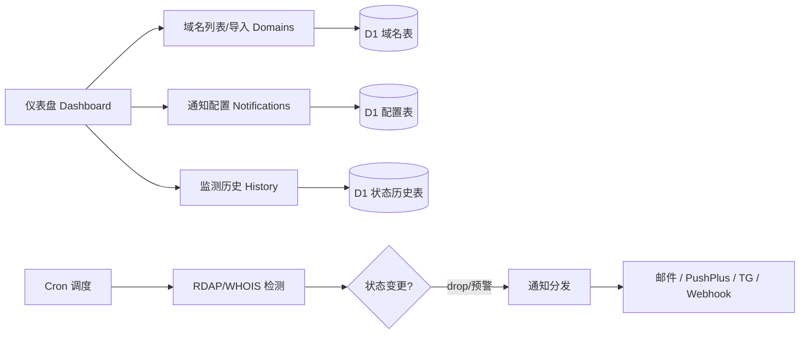

# 域名掉落监测与可注册性通知系统 — 产品需求文档（PRD）

> **TL;DR**：一套零运维、部署在 Cloudflare 边缘的域名 drop 监测器。用 Workers + D1 + Cron Triggers + Hono 实现，前端用 Pages 托管 SPA；域名可用性优先直接用 RDAP（免费）检测，drop 时通过邮件 / PushPlus / Telegram / Webhook 多通道告警。**在 Cloudflare 免费额度内可 $0 长期运行，覆盖数百域名日常监测**；若产品化对外售卖，建议 Free / Pro / Team 三档（¥0 / ¥39 / ¥129 每月），毛利率极高。

---

## 项目信息
- **Language**：简体中文（与用户需求一致）
- **Programming Language**：TypeScript（Cloudflare Workers + Hono），前端 Vite + React（轻量 SPA）
- **Project Name**：`domain_drop_monitor`
- **原始需求复述**：客户需一套部署在 Cloudflare 的系统，代码托管于 GitHub 并通过 Cloudflare Git 集成实现 push 即部署。系统需监测一批当前处于删除期（`pendingDelete`）、赎回期（`redemptionPeriod`）等过期状态的域名，在其变为可注册（drop）时第一时间通过邮件 / PushPlus / Telegram 等渠道通知。域名支持批量导入与自定义增删改，并支持分组、标签、备注。客户要求先提供产品文档与系统价格，再分任务开发。

---

## 1. 产品目标与一句话定位

- **一句话定位**：一个零运维、部署在 Cloudflare 边缘的域名掉落（drop）监测器——自动盯防即将释放的域名，并在可注册瞬间多通道告警。
- **Product Goals（3 个清晰、正交的目标）**：
  1. **可靠捕获 drop**：在域名从 `pendingDelete` 释放为可注册的极短窗口内完成检测并通知，漏报率趋近于 0。
  2. **低成本 / 零基础设施**：完全运行在 Cloudflare 免费额度内，push 即部署，无需自建服务器。
  3. **灵活可配置**：域名批量/单条管理 + 多通知渠道 + 分组标签，适配从个人炒米到小型域名商的多种场景。

---

## 2. 用户故事（User Stories）

1. **作为一名域名投资者**，我希望导入一批处于赎回期/删除期的域名并设置高频监测，以便它们一旦可注册我能第一时间收到 Telegram 通知去抢注。
2. **作为一名站长**，我希望按项目给域名打标签分组，以便我只关注某个业务线相关的域名状态变化。
3. **作为一名小团队运营**，我希望通过邮件和 PushPlus（微信）同时接收告警，以便不漏掉任何重要域名的掉落。
4. **作为一名开发者**，我希望系统代码开源在 GitHub 且 push 自动部署到 Cloudflare，以便我能自行修改和托管。
5. **作为一名谨慎用户**，我希望在域名进入 `redemptionPeriod` / `pendingDelete` 时收到"预警"，而不仅在真正 drop 时通知，以便我评估是否赎回或准备抢注。
6. **作为一名数据分析者**，我希望查看每个域名的状态变化历史，以便复盘监测和抢注成功率。

---

## 3. 需求池（Requirements Pool）

优先级定义：**P0 = Must have（必备）｜P1 = Should have（应有）｜P2 = Nice to have（增值）**

### P0 — 必备
| 编号 | 描述 | 验收标准 |
|---|---|---|
| **P0-1** 域名可注册性检测 | 系统按调度对监控域名执行状态检测，识别 EPP 状态（`ok` / `expired` / `redemptionPeriod` / `pendingDelete` / 未注册-`available`）。 | 单域名检测 ≤10s 返回当前状态；5 种状态枚举全覆盖；检测失败有重试与错误记录。 |
| **P0-2** 定时监测调度（Cron） | 使用 Cloudflare Cron Triggers 定时触发批量检测；支持按域名优先级分层频率（临期 5 分钟级、常规小时级、长周期天级）。 | 在 ≤3 个 Cron 触发器内实现 ≥2 档频率；调度误差 ≤ 触发周期；执行计入 Workers 请求额度。 |
| **P0-3** 域名管理（CRUD + 批量导入） | 支持单条增删改查；支持 CSV / 文本框批量导入；支持分组、标签、备注字段。 | CSV（含 `domain,group,tags,note` 列）导入成功率 100% 且重复域名幂等；单条编辑即时生效。 |
| **P0-4** 多通道通知 | 支持邮件（Resend/SMTP）、PushPlus（微信）、Telegram Bot 三种通知渠道，可同时启用多个。 | drop 事件发生后 ≤60s 内向所有已启用渠道送达；失败渠道自动重试并记录。 |
| **P0-5** 部署与 CI | GitHub 仓库托管代码；Cloudflare Pages（前端）/ Workers（后端）通过 Git 集成或 GitHub Action 实现 push 自动部署。 | 向 main 分支 push 后前端与 Worker ≤5 分钟内自动完成部署；提供可复现部署文档。 |

### P1 — 应有
| 编号 | 描述 | 验收标准 |
|---|---|---|
| **P1-1** 状态变更历史与仪表盘 | 记录每次检测状态与变更时间；仪表盘展示监控总数、各状态分布、近期 drop 数。 | 历史可查询 ≥90 天；仪表盘关键指标实时刷新。 |
| **P1-2** 临近预警 | 域名进入 `redemptionPeriod` / `pendingDelete` 时发送预警通知，区分"预警"与"drop 通知"模板。 | 状态首次进入两类时各发一次；不与 drop 通知混淆。 |
| **P1-3** 通知配置中心 | 可视化配置各渠道凭据与开关、接收人、通知抑制（同域名短时间不重复打扰）。 | 凭据加密存储；可单独关闭某渠道。 |
| **P1-4** 监测历史页 | 按域名/状态/时间筛选的列表与详情，支持分页与导出 CSV。 | 筛选结果准确；导出 CSV 字段完整。 |
| **P1-5** 可选 Webhook / 企业微信 | 提供通用 Webhook 与企微机器人通知。 | Webhook 以 JSON POST 送达；企微 Markdown 消息可达。 |

### P2 — 增值
| 编号 | 描述 | 验收标准 |
|---|---|---|
| **P2-1** 用户登录鉴权 | 多用户/账号体系（Cloudflare Access 或 D1 账号）。 | 未登录不可访问管理后台。 |
| **P2-2** 第三方 WHOIS/可用性 API 接入 | RDAP 之外接入 WhoisXML/DomScan，提高 CN 与特殊 TLD 覆盖与速率。 | 可切换数据源；按 TLD 路由。 |
| **P2-3** 抢注助手 | drop 时一键生成注册链接或调用注册商 API。 | 点击直达注册页或触发注册。 |
| **P2-4** API 开放 | 对外提供域名增删查与状态查询 REST API + Key。 | 带 Key 鉴权的 CRUD 可用。 |
| **P2-5** 多语言 / 暗色主题 | 中英切换、主题切换。 | 切换可用且持久化。 |

---

## 4. UI 设计稿

### 4.1 信息架构（Mermaid）


### 4.2 仪表盘（Dashboard）
```
┌──────────────────────────────────────────────┐
│  域名掉落监测器            [+ 导入域名] [设置] │
├──────────┬──────────┬──────────┬─────────────┤
│ 监控总数 │ 可注册   │ 删除期   │ 赎回期      │
│  1,284   │    3     │   42     │    17       │
├──────────┴──────────┴──────────┴─────────────┤
│ 近期 drop 时间线 (最近 7 天)                  │
│  • 10-02 14:03  example-xyz.com → 已通知 TG  │
│  • 10-01 09:11  best-name.io  → 已通知邮件   │
├──────────────────────────────────────────────┤
│ 状态分布饼图   │  各分组监控量 Top5            │
└──────────────────────────────────────────────┘
```

### 4.3 域名列表 / 导入（Domains）
```
┌────────────────────────────────────────────────────┐
│ 域名 │ 状态 │ 分组 │ 标签 │ 下次检测 │ 操作       │
├──────┼──────┼──────┼──────┼──────────┼────────────┤
│ a.com│pendingDelete│抢注│#短│ 14:05 │编辑 删除   │
│ b.io │ ok   │观察  │#品牌│ 15:00 │编辑 删除   │
└──────┴──────┴──────┴──────┴──────────┴────────────┘
[批量导入] 方式： (•) 文本框  ( ) CSV上传  ( ) API
文本框示例：
  example.com, 抢注, #短字符
  test.io, 观察, #品牌
[导入]  [下载模板]
```

### 4.4 通知配置（Notifications）
```
┌────────────────────────────────────────────┐
│ 通知渠道配置                                │
│ ☑ 邮件 (Resend)   API Key: ••••• 收件人:.. │
│ ☑ PushPlus(微信)  Token: •••••            │
│ ☑ Telegram        BotToken:••• ChatID:••• │
│ ☐ Webhook         URL: •••                │
│ ☐ 企业微信         Webhook: •••           │
│ 通知抑制：同域名 30 分钟内不重复通知        │
│ [保存]                                        │
└────────────────────────────────────────────┘
```

### 4.5 监测历史（History）
```
┌──────────────────────────────────────────────────┐
│ 筛选: [域名▾] [状态▾] [时间范围▾] [查询] [导出CSV] │
│ 时间 │ 域名 │ 旧状态 │ 新状态 │ 触发动作        │
│ 14:03│ x.com│pendingDelete│ available│→TG+邮件  │
└──────────────────────────────────────────────────┘
```

---

## 5. 系统价格模型

### A. 运行成本测算（客户自建自用）

**核心结论：在 Cloudflare 免费额度 + 直接使用 RDAP 协议（免费）的前提下，系统可长期 $0 运行，覆盖日常数百域名监测。**

#### A.1 Cloudflare 免费额度（关键约束）
| 资源 | 免费额度 | 备注 |
|---|---|---|
| Workers 请求 | 100,000 次/天（账户级） | Cron 执行也计入 |
| Cron Triggers | **每 Worker 最多 3 个**，最小粒度 1 分钟，**免费** | 架构必须 ≤3 档调度 |
| D1 读 / 写 | 5,000,000 / 100,000 行/天 | 状态历史写入 |
| KV 读 / 写 | 100,000 / 1,000 次/天 | 缓存/配置 |
| 子请求 | 免费计划每请求最多 50 个 | 单次 Cron 最多并发查 50 域名 |
| Email Routing | 免费 | 入站路由；出站需邮件服务 |

#### A.2 域名可用性检测成本（第三方对比）
- **首选：直接调用各注册局 RDAP 端点**（如 Verisign RDAP for .com/.net、CNNIC for .cn）——**免费、无需 API Key**，仅受各注册局速率限制。这是保持 $0 成本的关键。
- 若需更高覆盖/速率或使用 CN 特殊接口，可选付费 API：

| 服务商 | 免费额度 | 付费起步 | 适用 |
|---|---|---|---|
| RDAP 直连注册局 | 无限（受注册局限速） | $0 | 默认方案 |
| DomScan | 10,000 credits/月 | $10/月起 | gTLD 广覆盖 |
| WHOISJSON | 1,000/月 | $10/月（3 万次） | 轻量 |
| WhoisXML | 100（可用性）/ 500（WHOIS） | $30/月（2,000 次） | 企业级 |
| rdapapi.io | 7 天试用 | $9/月 | RDAP 封装 |

#### A.3 免费额度承载量测算
设计：单"调度 Worker"用 1 个 Cron（如每 5 分钟）+ D1 中每域名的 `next_check_at` 自适应频率；每次运行最多 50 个 RDAP 子请求。
- 日检测容量 ≈ 288 次/天 × 50 = **14,400 次/天**。
- 按监测频率折算可监控域名数：

| 检测频率 | 每域/天检测次数 | 免费额度可监控域名数 |
|---|---|---|
| 每 5 分钟 | 288 | ~50 |
| 每小时 | 24 | ~600 |
| 每 6 小时 | 4 | ~3,600 |
| 每天 | 1 | ~14,400 |

> D1 写入（状态变更日志）月需 ≤ 100K/天 × 30 = 300 万行，远未触顶；读取同理。故**瓶颈是每请求 50 子请求限制**，而非额度。

#### A.4 超出免费额度后的成本
- **Cloudflare Workers 付费版 $5/月**：含 1,000 万请求/月、3,000 万 CPU-ms/月，子请求上限提升至 1,000/请求。单 Cron 每分钟（43,200/月）× 1,000 子请求 ≈ 4,300 万次/月检测，可支撑万级域名高频监测。超出部分：请求 $0.30/百万、CPU $0.02/百万-ms，实际几乎不会触发。
- **邮件出站**：Resend 免费 3,000 封/月；超出 $20/月（5 万封）。PushPlus 免费有限额、会员低价。Telegram / Webhook / 企微免费。
- **第三方 WHOIS API**：按上表，重度使用约 $10–$30/月。
- **典型"进阶"月成本估算**（500 域名/小时级 + 邮件+TG + 少量 CN API）：Cloudflare $5 + Resend $0（免费内）+ DomScan $10 ≈ **$15/月（≈ ¥110）**。

### B. SaaS 定价模型（若产品化对外售卖）

**毛利说明**：底层 CF + RDAP 近乎零变动成本，规模化后边际成本极低，毛利率极高，适合订阅制。

| 档位 | 价格 | 监控域名 | 检测频率 | 通知渠道 | 历史留存 | 目标客群 |
|---|---|---|---|---|---|---|
| **Free** | ¥0 | ≤ 25 | 每小时 | 1 个（TG） | 7 天 | 个人炒米/爱好者、试用 |
| **Pro** | ¥39/月（年付 ¥29/月） | ≤ 500 | 每 5 分钟 | 全渠道 + 抑制 | 90 天 | 活跃域名投资人、独立站长 |
| **Team** | ¥129/月（年付 ¥99/月） | ≤ 3,000 | 每 1 分钟 | 全渠道 + Webhook/企微 | 1 年 | 域名商、代理机构、域名组合管理 |
| **Enterprise** | 定制 | 无限 | 定制 | SSO/API/私有部署 | 定制 | 大型注册商、基金 |

- **功能差异锚点**：Free 限域名数与渠道数；Pro 解锁高频 + 全渠道 + 分组标签 + 邮件摘要；Team 解锁多人协作 / 共享监控清单 / API / 优先支持。
- **获客建议**：Free 永久免费做口碑与引流；Pro 为目标主力付费档；Team 走 B 端销售。
- **定价依据**：对标同类域名监测/抢注工具（多 $9–$29/月），结合 CF 近乎零成本，定价具备强竞争力与高毛利空间。

---

## 6. 待确认问题清单（向客户澄清）

1. **域名范围**：是否包含 .cn 等 CNNIC 管理的国别域名？CN 域名生命周期与 RDAP 接口与 gTLD 不同，需单独适配。
2. **监测频率期望**：对"第一时间"的定义？临期域名希望多高频（5 分钟 / 1 分钟）？影响免费额度承载量与是否需付费版。
3. **登录鉴权**：是否需要多用户/账号登录？还是单人自用、无需鉴权（用 Cloudflare Access 或免登录）？
4. **是否公开售卖**：本工具仅自用，还是计划做成 SaaS 对外售卖（决定是否需要 P2 的账号体系 / API / 多租户）？
5. **通知渠道优先级**：客户最常用哪几个渠道？是否必须包含企业微信 / 钉钉？
6. **抢注动作**：drop 后仅通知，还是需要系统自动调用注册商 API 抢注（涉及账号与合规）？
7. **数据合规与留存**：状态历史需保留多久？是否涉及跨境数据存储合规（如 CN 用户数据出境）？
8. **域名来源**：导入后是否还需对接客户现有系统（表格/数据库/API）自动同步？

---

## 7. 技术栈与部署方式建议（供架构师细化）

- **运行时**：Cloudflare Workers（TypeScript）。
- **Web 框架**：Hono（轻量、对 Workers 友好、类型安全）。
- **存储**：D1（SQLite）——域名表、状态历史表、通知配置表；KV 用于配置缓存/限流（可选）。
- **调度**：Cloudflare Cron Triggers（≤3 个/Worker，1 分钟粒度，免费）。建议"单调度 Worker + D1 自适应 `next_check_at`"模式，用 1 个 Cron 即可支撑多档频率。
- **前端**：Vite + React SPA，托管于 **Cloudflare Pages**；或由 Worker 直接托管静态资源。
- **域名检测**：优先 **RDAP 直连注册局**（免费）；可选接入 WhoisXML / DomScan（P2）。
- **通知**：Resend（邮件，免费 3k/月）/ PushPlus（微信）/ Telegram Bot API / 通用 Webhook / 企微机器人。
- **部署流水线**：
  - 代码托管 GitHub（公开或私有）。
  - 前端：Cloudflare Pages **Git 集成**（连接 GitHub 仓库，push main 即构建部署）。
  - 后端 Worker：Wrangler + **GitHub Actions**（push/打 tag 自动 `wrangler deploy`），或 Cloudflare 直接 Git 集成。
  - 密钥（API Token、通知凭据）通过 Cloudflare 环境变量 / Secrets 管理，不进代码库。
- **明确非目标（边界）**：不做自建数据库服务器、不做复杂多租户隔离（除非确认 SaaS 化）。

---

*文档版本：v1.0 ｜ 作者：许清楚（产品经理）｜ 日期：2026-10-03 ｜ 状态：待客户澄清后进入开发拆分*
